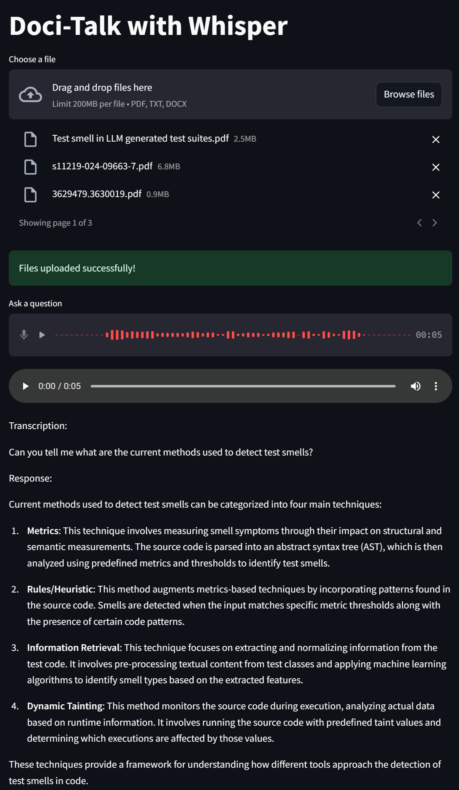

# Doci-Talk 🤖

A Python application that transcribes audio files using OpenAI's Whisper model and thenqueries uploaded data



## Setup

1. Create a virtual environment
```bash
python -m venv env
source venv/bin/activate  # On Windows: venv\Scripts\activate
```

2. Install dependencies
```bash
pip install -r requirements.txt
```

